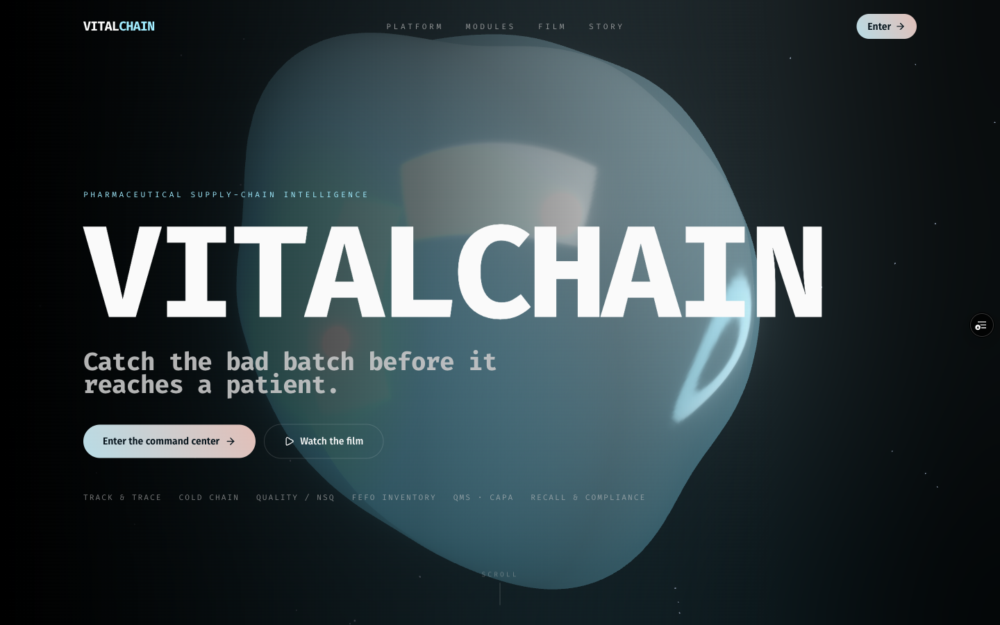
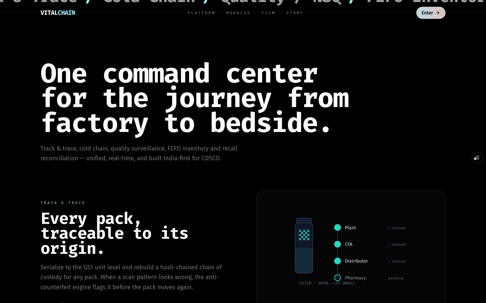
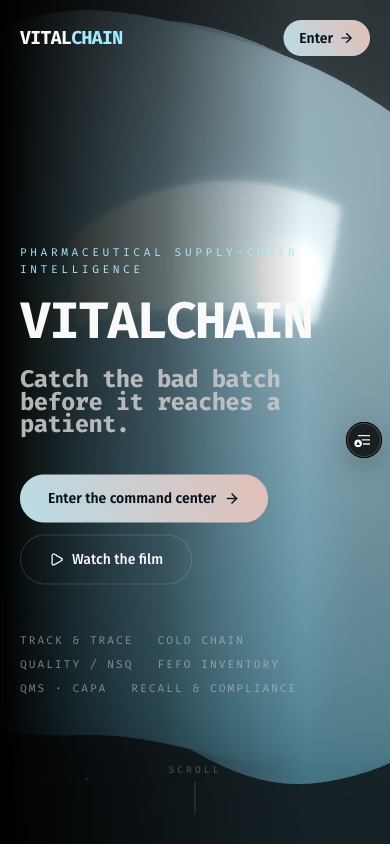

# VitalChain — Pharma Supply Chain Intelligence

Enterprise pharmaceutical supply-chain command center. **India-first** (CDSCO /
DAVA-iVEDA serialization, Schedule M, NLEM, WHO-GDP) with **international markets**
(US DSCSA, EU FMD) registered in the data model for expansion.

Built with **Next.js 16 + TypeScript (strict) + Tailwind v4 + Recharts**, fronted by an
immersive **React Three Fiber + react-spring** marketing landing.

## The landing — `/intro`

A full-bleed, immersive landing in the visual language of award-winning agency sites: a
WebGL liquid hero, per-letter spring-physics text, inertial smooth scroll and a
scroll-driven camera — on a pure-black stage with an icy + peach accent.



| Platform / features | Mobile |
|---|---|
|  |  |

**How it's built**
- **3D hero** — `three` + `@react-three/fiber` + `@react-three/drei`: a liquid
  Perlin-noise blob (`MeshDistortMaterial`) under **bloom**
  (`@react-three/postprocessing`), with a scroll-driven camera dolly and pointer parallax.
  Dynamically imported `ssr:false` from a Client Component, so it never runs during
  prerender — **zero hydration errors**.
- **Motion** — `@react-spring/web` physics (not CSS transitions): per-letter `useTrail`
  text reveals and `useSpring` scroll reveals, all `aria`-safe and
  `prefers-reduced-motion` aware.
- **Smooth scroll** — `lenis`, scoped to the landing only (the data-dense dashboard keeps
  native scrolling).
- **SEO preserved** — `/intro/page.tsx` stays a Server Component (metadata + JSON-LD)
  rendering a client landing; `AppShell` renders it full-bleed (no dashboard chrome).

## The seven modules

| Route | Module | What it does |
|-------|--------|--------------|
| `/` | **Command Center** | Unified KPIs, live India network map, priority alerts across all modules |
| `/trace` | **Track & Trace** | GS1 serialization, hash-chained chain-of-custody, anti-counterfeit risk scoring |
| `/quality` | **Quality & NSQ Watch** | CDSCO drug-alert ingestion, NSQ/spurious/DEG-EG detection, excipient integrity gating |
| `/coldchain` | **Cold Chain** | Live temperature profiles, **freeze + heat** excursion log, **Mean Kinetic Temperature** |
| `/inventory` | **Shortage & Inventory** | Demand forecast, **FEFO** expiry, **API geopolitical / single-source risk** |
| `/compliance` | **Recall & Compliance** | Cross-state recall tracker, supplier risk, **Schedule M GMP readiness**, multi-market posture |
| `/verify` | **Verify a Unit** | Point-of-dispense authentication (the consumer/pharmacist anti-counterfeit tool) |

> **The Quality & NSQ module, freeze detection, API geo-risk, excipient gating, cross-state
> recall, and GMP-readiness tracking were all added based on the findings in
> [`PHARMA_SUPPLY_CHAIN_RESEARCH.md`](./PHARMA_SUPPLY_CHAIN_RESEARCH.md)** — a multi-agent,
> citation-rich research report on real pharma supply-chain failures (India + global). The
> headline insight: in India, **substandard (NSQ) drugs and silent cold-chain freezing are a
> bigger threat than counterfeiting**, and there is **no mandatory nationwide recall law** —
> so the product is weighted accordingly.

## Architecture

```
src/
  app/                 # one route per module (client components — interactive charts)
  components/
    layout/            # AppShell: sidebar + topbar with live alert badges
    ui/                # design-system primitives (Card, Badge, Progress, Sparkline…)
    dashboard/         # PageHeader, KpiCard, AlertFeed
    charts/            # Recharts wrappers (temp profile, demand forecast, donut, bars)
    map/               # dependency-free SVG India map with projected nodes + animated routes
    landing/           # ⭐ Editorial-style /intro: WebGL hero-scene, split-text (spring),
                       #    reveal (spring), smooth-scroll (Lenis), SVG feature diagrams
  lib/
    types.ts           # ⭐ the domain model — the regulatory vocabulary as TypeScript
    analytics.ts       # MKT, stock health, shortage/supplier scoring, FEFO
    risk.ts            # ⭐ anti-counterfeit scoring engine (tunable business logic)
    data/
      seed.ts          # India pharma hubs, drug catalogue, markets, carriers
      engine.ts        # deterministic seeded data generator (no Math.random scatter)
    kpis.ts, format.ts, utils.ts
```

### Key design decisions
- **Deterministic seeded data** (`mulberry32`) so the same serial always resolves to
  the same genealogy — no React hydration mismatches, reproducible like a real ledger.
- **Domain model first.** `types.ts` encodes legally-defined relationships (batch →
  serial → recall) so the compiler enforces correctness everywhere.
- **Analytics isolated** from UI so scoring can be unit-tested / swapped for ML later.

## Run it

```bash
pnpm install
pnpm dev      # http://localhost:3000
pnpm build    # production build (Turbopack)
```

## Going to production (next steps)
- Swap `lib/data/engine.ts` for a Postgres-backed data layer (Prisma) — the UI reads
  through typed accessors, so this is a drop-in.
- Add auth + RBAC (`proxy.ts`) for the enterprise multi-tenant story.
- Wire real IoT telemetry (cold chain) and GS1 EPCIS feeds (track & trace).
- Plug in a forecasting microservice (Python) behind the demand API.
